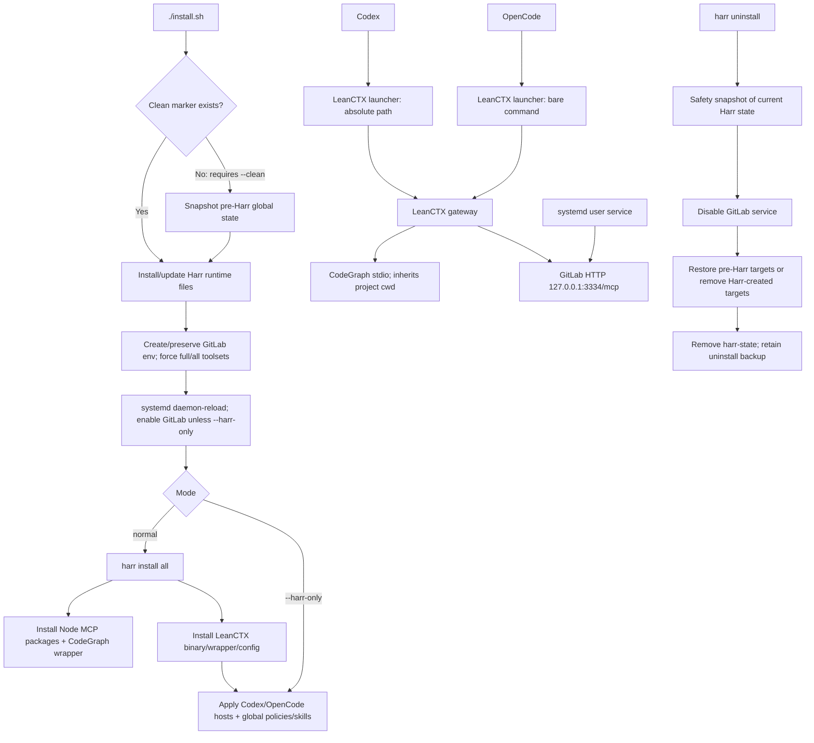

## Executive summary

Harr has a coherent clean-ownership design: snapshot first, own the global harness layer, route Codex/OpenCode through LeanCTX, keep CodeGraph project-bound via stdio, and restore the pre-Harr snapshot on uninstall. The main concerns are operational rather than conceptual:

- `--harr-only` does not apply the managed LeanCTX config, despite claiming to update global config.
- The GitLab systemd unit hard-codes `~/.config`, breaking non-default `XDG_CONFIG_HOME`.
- Rollback does not snapshot the retired CodeGraph systemd unit it deletes.
- The only integration test is valuable but intentionally synthetic; it does not exercise the full installer, real services, real Codex CLI, or downloads.

No files were edited; install, uninstall, and tests were not run. The repository status observed after the mandatory CodeGraph lookup contained untracked `.codegraph/` and `tools/`; their ownership was not inferred.

## Architecture and data-flow map

The initial ownership gate is enforced before writes, and later updates retain the original snapshot. [`linux/install.sh:88`](/home/nmkartsev/Projects/harr/linux/install.sh:88) [`linux/install.sh:220`](/home/nmkartsev/Projects/harr/linux/install.sh:220)

At runtime, both hosts register LeanCTX; CodeGraph is a stdio child that keeps the inherited working directory, while GitLab is a local HTTP gateway endpoint. [`config.toml:81`](/home/nmkartsev/Projects/harr/linux/files/leanctx/config.toml:81) [`config.toml:99`](/home/nmkartsev/Projects/harr/linux/files/leanctx/config.toml:99)

## Ownership and lifecycle

Shared/global state owned or rewritten:

- Whole global `AGENTS.md` files and exactly two skills under both Codex and OpenCode. [`agents.sh:54`](/home/nmkartsev/Projects/harr/linux/files/harr-cli/agents.sh:54) [`agents.sh:90`](/home/nmkartsev/Projects/harr/linux/files/harr-cli/agents.sh:90)
- Codex: only `mcp_servers.lean-ctx`; unrelated TOML is parsed and preserved. [`codex-config.py:49`](/home/nmkartsev/Projects/harr/linux/files/hosts/codex-config.py:49) [`codex-config.py:160`](/home/nmkartsev/Projects/harr/linux/files/hosts/codex-config.py:160)
- OpenCode: active config is reserialized to `opencode.jsonc`; selected legacy agents, commands, tools, permissions, and direct `codegraph`/`gitlab` MCP entries are removed. [`opencode-config.py:145`](/home/nmkartsev/Projects/harr/linux/files/hosts/opencode-config.py:145) [`opencode-config.py:192`](/home/nmkartsev/Projects/harr/linux/files/hosts/opencode-config.py:192)
- Launchers, libexec tree, Harr config, GitLab service/unit enablement, and state trees. [`harr-state:13`](/home/nmkartsev/Projects/harr/linux/files/state/harr-state:13) [`harr-state:41`](/home/nmkartsev/Projects/harr/linux/files/state/harr-state:41)

Reversibility:

- Normally reversible: every listed target has an existence bit plus `cp -a` payload; restore either replaces it exactly or removes the Harr-created target. [`harr-state:51`](/home/nmkartsev/Projects/harr/linux/files/state/harr-state:51) [`harr-state:111`](/home/nmkartsev/Projects/harr/linux/files/state/harr-state:111)
- Attention required: uninstall restores the point-in-time pre-Harr snapshot, so it overwrites any user changes made to these owned global paths after takeover. A current-state safety snapshot is retained separately, but restoration from it is manual/not exposed as a CLI command. [`harr-state:98`](/home/nmkartsev/Projects/harr/linux/files/state/harr-state:98) [`uninstall.sh:12`](/home/nmkartsev/Projects/harr/linux/files/harr-cli/uninstall.sh:12)
- Not fully reversible: the obsolete `harr-mcp-codegraph.service` is deleted, but is absent from the snapshot item list; its previous unit/enabled state cannot be restored. [`linux/install.sh:196`](/home/nmkartsev/Projects/harr/linux/install.sh:196) [`harr-state:41`](/home/nmkartsev/Projects/harr/linux/files/state/harr-state:41)

## Risks

1. **High — `--harr-only` leaves LeanCTX config stale.** It installs new source files but calls only `hosts apply` and `agents apply`; `cmd_leanctx_apply` runs only through `harr install all`. This conflicts with the installer help’s “global policy/config/skills” claim. [`linux/install.sh:61`](/home/nmkartsev/Projects/harr/linux/install.sh:61) [`linux/install.sh:227`](/home/nmkartsev/Projects/harr/linux/install.sh:227) [`components.sh:181`](/home/nmkartsev/Projects/harr/linux/files/harr-cli/components.sh:181)

2. **High — non-default `XDG_CONFIG_HOME` breaks GitLab systemd startup.** Installer/state use `${XDG_CONFIG_HOME:-~/.config}`, but the installed unit always reads `%h/.config/harr/{runtime,mcp/gitlab}.env`. [`linux/install.sh:16`](/home/nmkartsev/Projects/harr/linux/install.sh:16) [`harr-mcp-gitlab.service:6`](/home/nmkartsev/Projects/harr/linux/systemd/harr-mcp-gitlab.service:6)

3. **High — legacy CodeGraph service removal cannot be rolled back.** The installer disables/deletes the old unit and env, but pre-Harr state does not include that unit or its enablement link. The config root may restore `codegraph.env`, but not the service itself. [`linux/install.sh:196`](/home/nmkartsev/Projects/harr/linux/install.sh:196) [`harr-state:26`](/home/nmkartsev/Projects/harr/linux/files/state/harr-state:26)

4. **Medium — OpenCode depends on host PATH to find LeanCTX.** Codex uses an absolute LeanCTX path; OpenCode registers `["lean-ctx"]`. The wrapper only repairs PATH after LeanCTX has already been launched, so GUI hosts lacking `~/.local/bin` can fail before the wrapper runs. [`codex-config.py:42`](/home/nmkartsev/Projects/harr/linux/files/hosts/codex-config.py:42) [`opencode-config.py:182`](/home/nmkartsev/Projects/harr/linux/files/hosts/opencode-config.py:182) [`lean-ctx-wrapper:14`](/home/nmkartsev/Projects/harr/linux/files/leanctx/lean-ctx-wrapper:14)

5. **Medium — updates are not transactional.** Runtime files, systemd configuration, hosts, and policies are mutated sequentially; a failed update can leave a mixed old/new global harness. The original clean snapshot permits coarse rollback, not rollback to the immediately preceding update. [`linux/install.sh:132`](/home/nmkartsev/Projects/harr/linux/install.sh:132) [`linux/install.sh:220`](/home/nmkartsev/Projects/harr/linux/install.sh:220)

6. **Medium — OpenCode cleanup is name-based, not provenance-based.** Any current `mcp.codegraph`, `mcp.gitlab`, or legacy-named agent is removed regardless of who created it. This is consistent with clean takeover, but can remove an independently managed registration sharing those names. [`opencode-config.py:158`](/home/nmkartsev/Projects/harr/linux/files/hosts/opencode-config.py:158) [`opencode-config.py:173`](/home/nmkartsev/Projects/harr/linux/files/hosts/opencode-config.py:173)

7. **Medium — real Codex CLI behavior is untested.** CI forcibly disables the CLI and exercises only the fallback TOML writer. The official `codex mcp add` path, CLI-version compatibility, and preservation behavior are therefore not integration-tested. [`clean-harness.sh:11`](/home/nmkartsev/Projects/harr/tests/clean-harness.sh:11) [`codex-config.py:72`](/home/nmkartsev/Projects/harr/linux/files/hosts/codex-config.py:72)

8. **Medium — GitLab lifecycle/security is configuration-sensitive but untested.** The service is local-only and has basic systemd hardening, but it forces full permissions/full toolsets and injects the PAT into the LeanCTX process environment for secret-memento resolution. Real service start, port conflict, authentication, and secret handling are not exercised. [`linux/install.sh:185`](/home/nmkartsev/Projects/harr/linux/install.sh:185) [`gitlab-run:9`](/home/nmkartsev/Projects/harr/linux/files/mcp/gitlab-run:9) [`lean-ctx-wrapper:20`](/home/nmkartsev/Projects/harr/linux/files/leanctx/lean-ctx-wrapper:20)

## Test/CI coverage

Covered by `tests/clean-harness.sh`:

- Policy replacement, host adapter generation, fallback Codex TOML preservation, OpenCode legacy cleanup while retaining third-party config, commands, and skills. [`clean-harness.sh:72`](/home/nmkartsev/Projects/harr/tests/clean-harness.sh:72) [`clean-harness.sh:94`](/home/nmkartsev/Projects/harr/tests/clean-harness.sh:94)
- A later `--harr-only` call preserving the policy route.
- Snapshot-based rollback restoring representative original files and creating an uninstall safety snapshot. [`clean-harness.sh:135`](/home/nmkartsev/Projects/harr/tests/clean-harness.sh:135) [`clean-harness.sh:145`](/home/nmkartsev/Projects/harr/tests/clean-harness.sh:145)

CI runs shell syntax checks, Python compilation, and that one harness test on PRs and pushes to `main`. [`selftest.yml:3`](/home/nmkartsev/Projects/harr/.github/workflows/selftest.yml:3) [`selftest.yml:13`](/home/nmkartsev/Projects/harr/.github/workflows/selftest.yml:13)

Not covered:

- Initial `./install.sh --clean`, normal full install, `--start`, real systemd, or actual package/download installation.
- Real `XDG_CONFIG_HOME` systemd behavior—the test replaces `systemctl` with a no-op. [`clean-harness.sh:14`](/home/nmkartsev/Projects/harr/tests/clean-harness.sh:14)
- Codex CLI path, special TOML encodings, OpenCode host process PATH, actual CodeGraph cwd binding.
- GitLab PAT/service/endpoint/port-3334 lifecycle and update/interruption recovery.
- Rollback of the retired CodeGraph service, or automated recovery from uninstall safety snapshots.
- Documentation consistency around the `--harr-only` LeanCTX-config gap and XDG service caveat.

## Evidence

Primary implementation boundaries:

- Installer and modes: [`linux/install.sh`](/home/nmkartsev/Projects/harr/linux/install.sh:88)
- Snapshot/restore manifest: [`harr-state`](/home/nmkartsev/Projects/harr/linux/files/state/harr-state:41)
- Uninstall sequence: [`uninstall.sh`](/home/nmkartsev/Projects/harr/linux/files/harr-cli/uninstall.sh:6)
- Codex adapter: [`codex-config.py`](/home/nmkartsev/Projects/harr/linux/files/hosts/codex-config.py:160)
- OpenCode adapter: [`opencode-config.py`](/home/nmkartsev/Projects/harr/linux/files/hosts/opencode-config.py:145)
- LeanCTX gateway: [`config.toml`](/home/nmkartsev/Projects/harr/linux/files/leanctx/config.toml:75)
- Global-path documentation: [`README.md`](/home/nmkartsev/Projects/harr/README.md:301)

## Tool log

1. `functions.exec` — discovered Harr/LeanCTX tools; result: tool metadata.
2. `ctx_tools → codegraph_explore` — mandatory initial cross-file architecture query; result: indexed graph/source, limited to host adapters.
3. `functions.wait` — collected CodeGraph completion; result: full asynchronous response.
4. `ctx_tools → codegraph_explore` — targeted installer/rollback query; result: index still incomplete for shell lifecycle.
5. `ctx_glob` ×2 — scoped file discovery; result: one invalid-pattern error, one no-match result.
6. `ctx_read` — installer and core CLI files; result: source evidence.
7. `ctx_shell: git status --short` — repository-state check; result: two untracked paths.
8. `ctx_glob` — enumerated CLI modules; result: nine shell modules.
9. `ctx_read` — hosts, LeanCTX, MCP, uninstall, secret, test; result: source evidence.
10. `ctx_glob` — documentation inventory; result: ten Markdown files.
11. `ctx_read` — state helper, README, policy, unit; result: source evidence.
12. `ctx_read` — complete clean-harness test; result: line-numbered test evidence.
13. `ctx_read` — agent/config adapter details; result: source evidence.
14. `ctx_read` — installer/agent/uninstall/component slices; result: line-numbered source.
15. `ctx_read` — agent policy lifecycle slice; result: line-numbered source.
16. `ctx_read` — components, service runner, wrapper; result: line-numbered source.
17. `ctx_read` — LeanCTX config and host adapters; result: line-numbered source.
18. `ctx_glob` ×2 plus `ctx_read` — CI/doc boundary discovery; result: cached discovery plus README evidence.
19. `ctx_glob` — `.github` scope check; result: cached discovery descriptor.
20. `ctx_shell: git ls-files .github` — exact CI path confirmation; result: one workflow.
21. `ctx_read` — CI workflow; result: line-numbered source.
22. `ctx_read` — full state helper; result: line-numbered source.
23. `ctx_read` — installed-layout documentation; result: line-numbered source.
