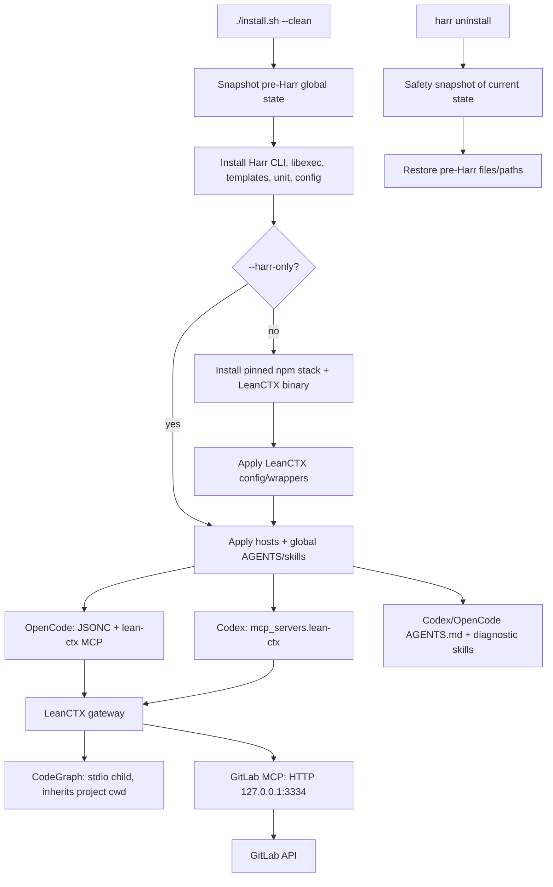

## Executive summary

Архитектура последовательно реализует «clean takeover»: до первой записи создаётся snapshot глобальных целей, затем Harr заменяет только определённый глобальный слой, а `harr uninstall` восстанавливает snapshot. Нормальный runtime-путь — host → LeanCTX → CodeGraph (stdio, cwd проекта) / GitLab (локальный HTTP).

Главные риски: разрешённый первый запуск с `--clean --harr-only` создаёт host registrations без установленных runtime-компонентов; OpenCode-адаптер намеренно переписывает конфиг; rollback восстанавливает файлы, но не прежнее состояние запущенного systemd-сервиса. Тесты хорошо покрывают takeover/rollback в изоляции, но не реальный runtime.

Файлы не менялись; тесты, install/uninstall и MCP не запускались. Рабочее дерево уже содержало untracked `.codegraph/` и `tools/`.

## Architecture and data-flow map

- Точка входа Linux перенаправляет в `linux/install.sh`; установленный CLI маршрутизирует `install`, `hosts`, `agents`, `leanctx`, `mcp`, `status`, `uninstall`. [install.sh](/home/nmkartsev/Projects/harr/install.sh:7), [linux/harr](/home/nmkartsev/Projects/harr/linux/harr:26)
- `--clean` обязателен, пока нет marker; snapshot выполняется до глобальных записей. [linux/install.sh](/home/nmkartsev/Projects/harr/linux/install.sh:88), [linux/install.sh](/home/nmkartsev/Projects/harr/linux/install.sh:215)
- LeanCTX выставляет шесть host-инструментов, отключает edit/patch и запускает CodeGraph как stdio-child; GitLab идёт через `127.0.0.1:3334/mcp`. [config.toml](/home/nmkartsev/Projects/harr/linux/files/leanctx/config.toml:13), [config.toml](/home/nmkartsev/Projects/harr/linux/files/leanctx/config.toml:81), [config.toml](/home/nmkartsev/Projects/harr/linux/files/leanctx/config.toml:99)
- Codex получает единственную managed MCP entry; OpenCode удаляет retired workflow pieces и оставляет LeanCTX плюс сторонние MCP. [codex-config.py](/home/nmkartsev/Projects/harr/linux/files/hosts/codex-config.py:195), [opencode-config.py](/home/nmkartsev/Projects/harr/linux/files/hosts/opencode-config.py:145)

## Ownership and lifecycle

| Глобальное состояние | Откат | Внимание |
|---|---|---|
| Codex/OpenCode AGENTS, конфиги, Harr/LeanCTX skills | Восстанавливается из pre-Harr snapshot | Любые пользовательские изменения после takeover будут заменены pre-Harr версией; текущая версия сохраняется отдельно как safety snapshot. |
| LeanCTX/CodeGraph/Harr launchers, libexec, Harr config, npm runtime, секрет | Покрыто snapshot-целями целиком | Секрет включён через корень `~/.config/harr`; права на секрет устанавливаются `0600`. |
| GitLab unit и enable-link | Файлы/link восстанавливаются | Запущенное состояние сервиса не snapshot’ится и автоматически не возвращается. |
| Пути при другом `CODEX_HOME`/`XDG_CONFIG_HOME` | Не гарантировано | Snapshot хранит исходные абсолютные targets; последующий запуск с другими переменными может затронуть новый набор путей. |

State-helper фиксирует существование и payload каждого известного глобального target, а restore удаляет target либо копирует исходный payload. [harr-state](/home/nmkartsev/Projects/harr/linux/files/state/harr-state:41), [harr-state](/home/nmkartsev/Projects/harr/linux/files/state/harr-state:51), [harr-state](/home/nmkartsev/Projects/harr/linux/files/state/harr-state:111)

GitLab PAT не хранится в LeanCTX config: wrapper читает локальный secret и передаёт его в secret-memento environment. [lean-ctx-wrapper](/home/nmkartsev/Projects/harr/linux/files/leanctx/lean-ctx-wrapper:20), [config.toml](/home/nmkartsev/Projects/harr/linux/files/leanctx/config.toml:108)

## Risks

1. **Первый `--clean --harr-only` создаёт сломанный host runtime.** Этот режим всё равно применяет `hosts` и `agents`, но пропускает `harr install all`, который создаёт пользовательский LeanCTX launcher и устанавливает компоненты. [linux/install.sh](/home/nmkartsev/Projects/harr/linux/install.sh:227), [components.sh](/home/nmkartsev/Projects/harr/linux/files/harr-cli/components.sh:138)

2. **`--harr-only` не является чисто безвредным policy refresh.** Он всё равно ставит unit/config, меняет GitLab env на `full/all`, запускает daemon-reload и удаляет legacy CodeGraph unit. При этом итоговое сообщение безусловно заявляет, что GitLab service enabled, хотя enable выполняется только без `--harr-only`. [linux/install.sh](/home/nmkartsev/Projects/harr/linux/install.sh:185), [linux/install.sh](/home/nmkartsev/Projects/harr/linux/install.sh:206), [linux/install.sh](/home/nmkartsev/Projects/harr/linux/install.sh:241)

3. **OpenCode clean-up может удалить легитимные пользовательские совпадения.** Адаптер удаляет заранее названные agents, tool/permission keys, MCP names и commands; также нормализует JSONC в JSON и удаляет `opencode.json`, если он существует. Snapshot делает это обратимым, но не безопасным как live mutation. [opencode-config.py](/home/nmkartsev/Projects/harr/linux/files/hosts/opencode-config.py:145), [opencode-config.py](/home/nmkartsev/Projects/harr/linux/files/hosts/opencode-config.py:192)

4. **Нет транзакции или lock между snapshot и apply.** Ошибка в середине install оставляет частичный global state; rollback возможен, но не запускается автоматически. Параллельные install/update также не сериализуются. [linux/install.sh](/home/nmkartsev/Projects/harr/linux/install.sh:221), [linux/install.sh](/home/nmkartsev/Projects/harr/linux/install.sh:223)

5. **Codex fallback не поддерживает inline/dotted representation managed entry.** Если `mcp_servers.lean-ctx` не table, fallback намеренно abort’ится; это безопаснее порчи конфига, но блокирует update на host без `codex` CLI. [codex-config.py](/home/nmkartsev/Projects/harr/linux/files/hosts/codex-config.py:124)

6. **Rollback откатывает и post-takeover изменения в shared config.** Safety snapshot сохраняется, но восстановление возвращает весь `config.toml`/OpenCode config, а не только Harr-owned block; ручное извлечение поздних пользовательских изменений потребуется из backup. [uninstall.sh](/home/nmkartsev/Projects/harr/linux/files/harr-cli/uninstall.sh:12), [harr-state](/home/nmkartsev/Projects/harr/linux/files/state/harr-state:122)

7. **GitLab lifecycle зависит от fixed port и не имеет install-time health gate.** Service фиксирован на `127.0.0.1:3334`, restart делегируется systemd, но installer не проверяет итоговый endpoint. Коллизия порта/неполный npm runtime проявится только при запуске или status. [gitlab.env.example](/home/nmkartsev/Projects/harr/linux/files/mcp/gitlab.env.example:2), [linux/install.sh](/home/nmkartsev/Projects/harr/linux/install.sh:234)

8. **Rollback не восстанавливает активность systemd unit.** Он делает `disable --now`, восстанавливает unit и enable-link как файлы, затем только `daemon-reload`; предыдущий запущенный сервис не стартует обратно. [uninstall.sh](/home/nmkartsev/Projects/harr/linux/files/harr-cli/uninstall.sh:16), [harr-state](/home/nmkartsev/Projects/harr/linux/files/state/harr-state:26)

## Test/CI coverage

Покрыто:

- Shell syntax всех shell entrypoints и Python compile host adapters. [selftest.yml](/home/nmkartsev/Projects/harr/.github/workflows/selftest.yml:13)
- Изолированный clean snapshot, полная замена AGENTS, сохранение сторонних Codex/OpenCode settings, очистка retired OpenCode config. [clean-harness.sh](/home/nmkartsev/Projects/harr/tests/clean-harness.sh:72)
- Поздний `linux/install.sh --harr-only` — но проверяется только policy output. [clean-harness.sh](/home/nmkartsev/Projects/harr/tests/clean-harness.sh:135)
- Uninstall restore и existence safety snapshot. [clean-harness.sh](/home/nmkartsev/Projects/harr/tests/clean-harness.sh:145)

Не покрыто:

- Реальный first install/full stack: npm download, checksum LeanCTX, wrapper и package runtime.
- Реальный systemd, bind/port `3334`, GitLab MCP health и auth.
- Codex CLI writer: harness принудительно использует fallback. [clean-harness.sh](/home/nmkartsev/Projects/harr/tests/clean-harness.sh:11)
- LeanCTX config validation, CodeGraph stdio/cwd binding, secret migration/permissions.
- Первая установка с `--clean --harr-only`, частичные install failures, concurrent runs, смена `CODEX_HOME`/`XDG_CONFIG_HOME`, dual `opencode.jsonc` + `opencode.json`, и сохранение пользовательских изменений после takeover.

CI запускается на PR и push в `main`; иных test workflows в репозитории не обнаружено. [selftest.yml](/home/nmkartsev/Projects/harr/.github/workflows/selftest.yml:3)

## Evidence

- Полный заявленный scope и global-vs-project boundary: [README.md](/home/nmkartsev/Projects/harr/README.md:123)
- Перечень установленных глобальных путей: [README.md](/home/nmkartsev/Projects/harr/README.md:301)
- Правила policy и host-specific adapter substitution: [tool-routing.template.md](/home/nmkartsev/Projects/harr/linux/files/policy/tool-routing.template.md:1), [agents.sh](/home/nmkartsev/Projects/harr/linux/files/harr-cli/agents.sh:67)
- Codex adapter использует CLI либо validated TOML fallback: [codex-config.py](/home/nmkartsev/Projects/harr/linux/files/hosts/codex-config.py:72), [codex-config.py](/home/nmkartsev/Projects/harr/linux/files/hosts/codex-config.py:160)
- GitLab service contract: [harr-mcp-gitlab.service](/home/nmkartsev/Projects/harr/linux/systemd/harr-mcp-gitlab.service:4), [gitlab-run](/home/nmkartsev/Projects/harr/linux/files/mcp/gitlab-run:4)
- Documented rollback contract: [README.md](/home/nmkartsev/Projects/harr/README.md:158)

## Tool log

| № | Command/tool | Цель | Тип результата |
|---:|---|---|---|
| 1 | Native terminal: `pwd`, `rg --files` | Установить workspace и исходную структуру | Список файлов |
| 2 | Native terminal: `wc`, `git status`, `git log -1` | Оценить объём, состояние worktree, revision | Метаданные/статус |
| 3 | Native terminal: numbered read entrypoints/installer/components | Проследить install и component lifecycle | Исходный код с номерами строк |
| 4 | Native terminal: numbered read CLI modules | Проверить policy, hosts, MCP, secret, uninstall flows | Исходный код с номерами строк |
| 5 | Native terminal: numbered read state/helper adapters | Проверить ownership snapshot и Codex/OpenCode mutations | Исходный код с номерами строк |
| 6 | Native terminal: numbered read runtime config/docs/tests | Проверить LeanCTX/GitLab/CodeGraph path и harness | Исходный код/документация |
| 7 | Native terminal: hidden CI discovery + targeted search | Найти CI и границы test/documentation coverage | Список workflow и совпадения текста |
| 8 | Native terminal: numbered read CI и diagnostic references | Подтвердить CI jobs и documented lifecycle boundaries | YAML/Markdown с номерами строк |
